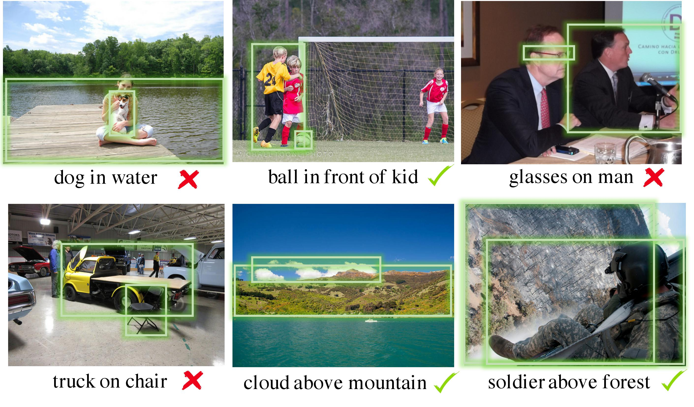

# SpatialSense



Dataset and code for the paper:  

[SpatialSense: An Adversarially Crowdsourced Benchmark for Spatial Relation Recognition](https://arxiv.org/abs/1908.02660)  
Kaiyu Yang, Olga Russakovsky, and Jia Deng   
International Conference on Computer Vision (ICCV) 2019   

```
@inproceedings{yang2019spatialsense,
  title={SpatialSense: An Adversarially Crowdsourced Benchmark for Spatial Relation Recognition},
  author={Yang, Kaiyu and Russakovsky, Olga and Deng, Jia},
  booktitle={International Conference on Computer Vision},
  year={2019},
}
```


## Dataset

Download the SpatialSense dataset [here](https://drive.google.com/drive/folders/125fgCq-1YYfKOAxRxVEdmnyZ7sKWlyqZ?usp=sharing), including images and annotations of spatial relations. 
The instructions below assume you have downloaded the dataset to the root of the repositiory and unzipped `images.tar.gz`.

### Data Format

The `annotation.json` file contains a list in which each element contains the annotations for a single image.
For example, the first element is:

```
{
  'url': 'https://farm4.staticflickr.com/3543/5704634119_8b8ccf3229.jpg',  # URL for Flickr Images
  'nsid': '10392797@N03',                                                  # Flickr NSID of the user
  'height': 500,
  'width': 281,
  'split': 'train',                                                        # train/valid/test split
  'annotations': [{                                                        # a list of spatial relations
    '_id': '59fbffe4f25c8070bb77ec42',                                     # an unique identifier for the relation      
    'predicate': 'on',               
    'object': {
      'y': 402,                                                            # (x, y) is a point on the object
      'x': 148,
      'name': 'ground',
      'bbox': [196, 500, 3, 278]                                           # bounding box
    },
    'subject': {
      'y': 317, 
      'x': 157, 
      'name': 'cat', 
      'bbox': [230, 434, 31, 264]
    },
    'label': True                                                          # the relation is a positive example
    }, {
    '_id': '59ff0e910de0c80e4077c5f0',
    'predicate': 'to the left of',
    'object': {
      'y': 213,
      'x': 240,
      'name': 'mirror',
      'bbox': [0, 345, 160, 280]
    },
    'subject': {
      'y': 303, 
      'x': 143, 
      'name': 'cat', 
      'bbox': [226, 449, 33, 271]
    },
    'label': True},
  ...  
  ]}
```

**Conventions for coordinates and bounding boxes**: The origin is the upper-left corner of an image; the x-axis is along the width, and the y-axis is alone the height. A bounding box `[y0, y1, x0, x1]` has `(x0, y0)` as its upper-left corner and `(x1, y1)` as its bottom-right corner. 


### Visualizations

To visualize the relations in SpatialSense: `python visualize.py`  
Run `python visualize.py --help` to see the options.


## Baselines

### Dependencies

* [Anaconda Python 3](https://www.anaconda.com/distribution/)
* [PyTorch](https://pytorch.org/)

Assuming you are in the `./baselines` directory, below are instructions for reproducing the baselines in the paper. 

### Language-only

1. Download the pre-trained Word2Vec model [GoogleNews-vectors-negative300.bin.gz.](https://drive.google.com/file/d/0B7XkCwpI5KDYNlNUTTlSS21pQmM/edit?usp=sharing) to the `./baselines` directory.
2. Run `python main_L.py --train_split train_valid --exp_id language-only`

Predictions and model checkpoints will be saved in `./runs/language-only`.

### 2D-only

1. Run `NO_WORD2VEC=1, python main_S.py --train_split train_valid  --exp_id 2d-only`

Predictions and model checkpoints will be saved in `./runs/2d-only`.


### Vip-CNN

1. Run `python main.py --train_split train_valid --exp_id vipcnn --model vipcnn --learning_rate 4e-4 --l2 5e-7 --n_epochs 40 --batchsize 16 --patience 18`

Predictions and model checkpoints will be saved in `./runs/vipcnn`.


### Peyre et al.

1. Extract the spatial features: `python unrel/spatial_features.py`
2. Extract the appearance features: `python unrel/appearance_features.py`
3. Train and test the model `python unrel/train.py --spatial --appr --no_val`

### PPR-FCN

1. Run `python main.py --train_split train_valid --exp_id pprfcn --model pprfcn --backbone resnet101 --learning_rate 3e-4 --l2 6e-7 --batchsize 7 --patience 14`

Predictions and model checkpoints will be saved in `./runs/pprfcn`.


### DRNet

1. Download the pre-trained Word2Vec model [GoogleNews-vectors-negative300.bin.gz.](https://drive.google.com/file/d/0B7XkCwpI5KDYNlNUTTlSS21pQmM/edit?usp=sharing) to the `./baselines` directory.
2. Run `python main.py --train_split train_valid --exp_id drnet --model drnet --learning_rate 1.5e-4 --l2 2.8e-4`

Predictions and model checkpoints will be saved in `./runs/drnet`.


### VTransE

1. Download the pre-trained Word2Vec model [GoogleNews-vectors-negative300.bin.gz.](https://drive.google.com/file/d/0B7XkCwpI5KDYNlNUTTlSS21pQmM/edit?usp=sharing) to the `./baselines` directory.
2. Run `python main.py --train_split train_valid --exp_id vtranse --model vtranse --learning_rate 6e-4 --l2 3e-4 --feature_dim 128`

Predictions and model checkpoints will be saved in `./runs/vtranse`.


## Spatial Relations in 3D

In a more recent [paper](https://arxiv.org/abs/2012.01634), we constructed [**Rel3D**](https://github.com/princeton-vl/Rel3D): the first large-scale, human-annotated dataset for grounding spatial relations in 3D. It enables quantifying the effectiveness of 3D information in predicting spatial relations. Moreover, we propose minimally contrastive data collection—a novel crowdsourcing method for reducing dataset bias. The examples in Rel3D come in **minimally contrastive pairs**: two examples in a pair are almost identical but have different labels.


